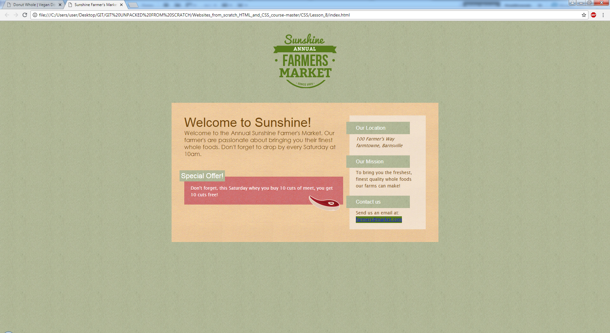
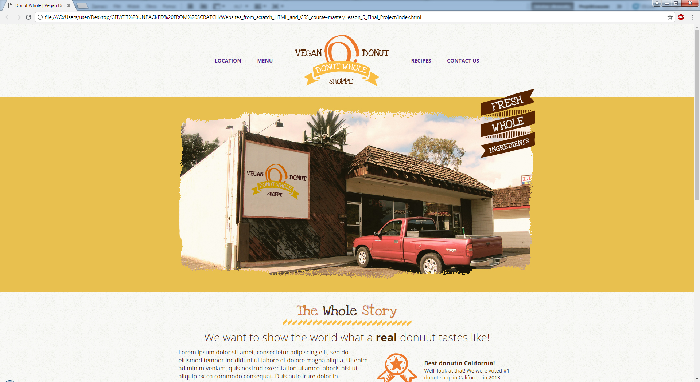

- - - 
## Front-end courses from Udemy
- - -
### 1. Build Websites from Scratch with HTML &amp; CSS. :heavy_check_mark:    
- - -

**Lesson 1.** My first web page! :heavy_check_mark:  
**Lesson 2.** My first mini website. Basic html. :heavy_check_mark:   
**Lesson 3.** Forms, tables and special characters. :heavy_check_mark:   
**Lesson 4.** A blog post style web page. :heavy_check_mark:   
**Lesson 5.** My first website tiwh CSS. :heavy_check_mark:   
**Lesson 6.** Minimalistic website. :heavy_check_mark:   
**Lesson 7.** Website with reservation form. :heavy_check_mark:   

> Lesson 7 webpage screenshot

**Lesson 8.** Simple website - farmers market. :heavy_check_mark: 

> Lesson 8 webpage screenshot

**Lesson 9.** Final project - vegan donut shoppe website. :heavy_check_mark:    

> Lesson 9 - final webpage screenshot

- - -

### 2. React JS, Angular & Vue JS - Quickstart & Comparison.

- - -

In progress..

- - -

### 3. Learn Webpack 2 from scratch.

- - -

In progress..

- - -

### 4. The Complete JavaScript Course 2019: Build Real Projects!

- - -

In progress..

- - -

### 5. Modern JavaScript From The Beginning.

- - -

In progress..
