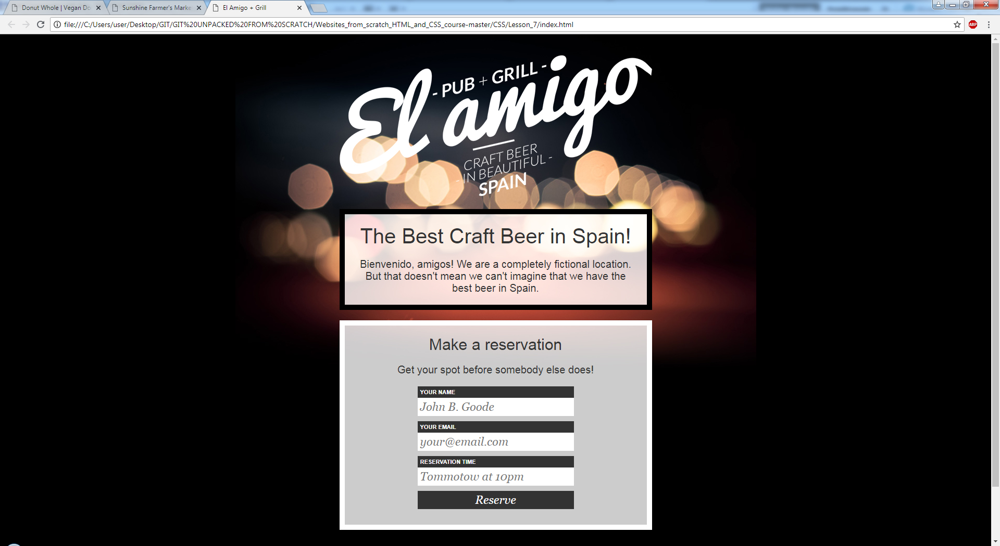

# websites_from_scratch_html_and_css_course
## Build Websites from Scratch with HTML &amp; CSS. Udemy course.

:heavy_check_mark: **Lesson 1.** My first web page!  
:heavy_check_mark: **Lesson 2.** My first mini website. Basic html.  
:heavy_check_mark: **Lesson 3.** Forms, tables and special characters.  
:heavy_check_mark: **Lesson 4.** A blog post style web page.  
:heavy_check_mark: **Lesson 5.** My first website tiwh CSS.  
:heavy_check_mark: **Lesson 6.** Minimalistic website.  
:heavy_check_mark: **Lesson 7.** Website with reservation form.

> Webpage printscreen

      
:heavy_check_mark: **Lesson 8.** Simple website - farmers market.      
      
:heavy_check_mark: **Lesson 9.** Final project - vegan donut shoppe website.      
      
